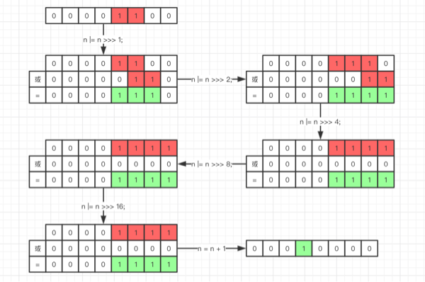

## 背景描述
业务同事和其他公司合作活动，对方公司筛选 2W 优质用户手机号提供给我方，出于安全考虑（其实具体原因未知），对方提供的手机号都是 MD5 加密内容；业务同事想对这 2W 用户做短信触达，搞促销活动，业务找到研发需要将现在的 2W MD5 手机号内容逆向转换成用户手机号，然后发短信，需求场景就是这样。

**PS. 一句话需求，2W MD5 手机号内容，需要逆向碰撞出手机号明文，做短信促销。**

<!-- more -->

## 实现过程

我们都知道 MD5 是不可逆的，所以通过密文反向出明文是基本不太可行的；想到的可行方式就是穷举所有号段手机号，将所有手机号 MD5 后看是否包含在对方提供的 2W 手机号里，如果包含在里面就找到了一个手机号。

### 方案一

程序穷举某个号段所有手机号内容，生成 13400000000 ~ 13499999999 所有手机号（可能某些手机号不存在，但是拿不到运营商真实手机号，只好穷举），每个号段 `10的8次方` 个号码；
```
13400000000
13400000001
... ...
//中间数据省略
... ...
13499999998
13499999999
```
程序将 2W 手机号 MD5 内容装入 `ArrayList` 集合，对于每一个穷举的手机号码，首先生成 MD5 内容，然后判断生成的 MD5 内容在 `ArrayList` 集合中是否存在，存在则碰撞到一个手机号保存下来：

```java
// 2W MD5 手机号内容
List<String> md5PhoneList = new ArrayList<>();
// 穷举某个号段所有手机号 10的8次方 个号码
List<String> allPhoneNumList = new ArrayList<>(); 
for (String phone : allPhoneNumList) {
    String md5Str = md5(phone);
    if (md5PhoneList.contains(md5Str)) {
        System.out.println(phone);
    }
}
```
执行结果，大概一天才能跑完一个号段数据。当时汇总了一下，运营商常用号段至少在 40 多个，整个都跑完大概需要 1 个多月时间，理论 & 实际都不可接受。

### 方案二

在某位同事启发下，改用 `HashMap` 尝试一下，`HashMap` 提前将穷举的手机号和 MD5 内容一同写入某个文件，调整程序JVM堆内存大小，程序直接读取文件（单个文件大概 500M），将穷举的内容直接读入内存 `HashMap` 结构中，然后循环判断 2W MD5 内容在 `HashMap` 中是否存在，存在则碰撞到一个手机号保存下来

```
// 文件内容
cd6b58233d21f2cc3a1fe6eecda4a17d:13400000000
08f13675e2ed8813d519f01a6f3a2c75:13400000001
... ...
//中间数据省略
... ...
23e008be8bfe30dc24d99f246d4a363f:13499999998
2ee6697e49a60130012f2f2824fa1778:13499999999
```

```java
// 2W MD5 手机号内容
List<String> md5PhoneList = new ArrayList<>();
// 文件读取某个号段所有手机号，key:value -> MD5内容:手机号
Map<String, String> allPhoneNumList = readFile(); 
for (String phone : md5PhoneList) {
    String value = allPhoneNumList.get(phone);
    if (value != null && !value.isEmpty()) {
        System.out.println(value);
    }
}
```

执行结果，第一步生成所有 `手机号MD5:手机号明文` 内容，写入某个文件（几分钟搞定），然后通过程序进行碰撞真实手机号（几十秒完成），一通操作下来 10 分钟搞定一个号段，方案 OK。
这段时间分成两步操作，第一步找到所有运营商号段，每个号段生成一个文件内容；第二步单个文件开始进行处理，最终整个工作一天完成。

**PS. 这期间先用一台普通 windows 机器（SSD硬盘）处理，生成 `手机号MD5:手机号明文` 内容写入文件中，写入速度不是很快，生成一个文件要十几分钟，后来改用自己的 MAC PRO 机器，写入文件速度明显加快，几分钟搞定一个文件，速度提升好几倍，所以说 `工欲善其事，必先利其器` 还是很有道理的。**

## 源码分析

对于 `ArrayList` 的 `boolean contains(Object o);` 方法，内部是通过循环的方式逐一判断是否存在的，时间复杂度为 O(n)：

```java
public boolean contains(Object o) {
    return indexOf(o) >= 0;
}

public int indexOf(Object o) {
    if (o == null) {
        for (int i = 0; i < size; i++)
            if (elementData[i]==null)
                return i;
    } else {
        for (int i = 0; i < size; i++)
            if (o.equals(elementData[i]))
                return i;
    }
    return -1;
}
```

对于 `HashMap` 的 `V get(Object key);` 方法，内部是通过 hash 结构来存储和获取的，如果 hash 函数设计的非常优秀，理想情况下是可以达到 `O(1)` 的时间繁杂度的，当然这是理想情况，后面我们还会再分析实际时间复杂度：

```java
public V get(Object key) {
    Node<K,V> e;
    return (e = getNode(hash(key), key)) == null ? null : e.value;
}

final Node<K,V> getNode(int hash, Object key) {
    Node<K,V>[] tab; Node<K,V> first, e; int n; K k;
    if ((tab = table) != null && (n = tab.length) > 0 &&
        (first = tab[(n - 1) & hash]) != null) {
        if (first.hash == hash && // always check first node
            ((k = first.key) == key || (key != null && key.equals(k))))
            return first;
        if ((e = first.next) != null) {
            if (first instanceof TreeNode)
                return ((TreeNode<K,V>)first).getTreeNode(hash, key);
            do {
                if (e.hash == hash &&
                    ((k = e.key) == key || (key != null && key.equals(k))))
                    return e;
            } while ((e = e.next) != null);
        }
    }
    return null;
}
```

这只是上面需求的一个实现过程，下面我们来具体分析一下 `HashMap` 中的一些关键内容的实现原理。

> 前面描述的是真实的工作场景，`HashMap` 最终搞定了这个工作，如果有更好的实现方案，也欢迎大家留言讨论。

## JDK版本
> JDK 8

## 全局变量定义
```java
/**
 * HashMap 初始容量 16，必须为 2的n次幂
 */
static final int DEFAULT_INITIAL_CAPACITY = 1 << 4; // aka 16

/**
 * HashMap 最大容量，必须为 2的n次幂，并且 <= (1 << 30)
 */
static final int MAXIMUM_CAPACITY = 1 << 30;

/**
 * 默认负载因子 0.75
 */
static final float DEFAULT_LOAD_FACTOR = 0.75f;

/**
 * 一个 bin 中 Node 节点存储结构由链表转换为红黑树的阈值 = 8，
 * 当一个 bin 中 Node 节点数量较少时使用链表存储
 * 当 Node 数量大于 8 时转换为红黑树存储结构。
 */
static final int TREEIFY_THRESHOLD = 8;

/**
 * 执行扩容操作之后，bin 中 Node 节点存储结构由红黑树转换为链表的阈值 = 6
 * 执行扩容操作之后，bin 中 Node 节点数量会减少，当少于 6 个时，Node 存储结构由红黑树转换成链表
 */
static final int UNTREEIFY_THRESHOLD = 6;

/**
 * bins 执行树化（转换成红黑树）操作时 HashMap 容量的最小值。
 * 也就是说，如果某个 bin 中 Node 节点数量很多，并不会马上进行树化操作，而是 HashMap 会先进行扩容操作，
 * 当容量 >= 64 后，某个 bin 中 Node 节点数量 >= TREEIFY_THRESHOLD 才会执行树化操作。
 * 这个值至少是 4 倍的 TREEIFY_THRESHOLD 值，这样可以避免 HashMap 扩容操作和树化阈值之间的冲突。
 */
static final int MIN_TREEIFY_CAPACITY = 64;
```
从全局变量的定义我们可以总结如下一下信息：
- JDK8 中 HashMap 初始容量和负载因子分别为 16 和 0.75；
- JDK8 中 HashMap 存储结构转换为 `数组 + 链表 + 红黑树`，之前为 `数组 + 链表`;
- 数组某个位置下链表长度 >= 8时，可能会执行树化操作，进化成 `红黑树` 存储结构；
- 当 HashMap 执行扩容操作之后，数组某个位置下节点数量会变少，当 <= 6 个时，会从红黑树退化成链表；
- `TREEIFY_THRESHOLD` + `MIN_TREEIFY_CAPACITY` 两个值共同决定了链表是否执行树化操作。

## 构造函数初始化
```java
/**
 * Constructs an empty <tt>HashMap</tt> with the specified initial
 * capacity and load factor.
 *
 * @param  initialCapacity the initial capacity
 * @param  loadFactor      the load factor
 * @throws IllegalArgumentException if the initial capacity is negative
 *         or the load factor is nonpositive
 */
public HashMap(int initialCapacity, float loadFactor) {
    if (initialCapacity < 0)
        throw new IllegalArgumentException("Illegal initial capacity: " +
                                           initialCapacity);
    if (initialCapacity > MAXIMUM_CAPACITY)
        initialCapacity = MAXIMUM_CAPACITY;
    if (loadFactor <= 0 || Float.isNaN(loadFactor))
        throw new IllegalArgumentException("Illegal load factor: " +
                                           loadFactor);
    this.loadFactor = loadFactor;
    this.threshold = tableSizeFor(initialCapacity);
}

/**
 * Returns a power of two size for the given target capacity.
 * 根据给定的 capacity 参数，初始化容量为 2的k次幂
 */
static final int tableSizeFor(int cap) {
    int n = cap - 1;
    n |= n >>> 1;
    n |= n >>> 2;
    n |= n >>> 4;
    n |= n >>> 8;
    n |= n >>> 16;
    return (n < 0) ? 1 : (n >= MAXIMUM_CAPACITY) ? MAXIMUM_CAPACITY : n + 1;
}
```
如果在初始化 `HashMap` 时指定了 `initialCapacity` 参数，由于 HashMap 要求 `capacity` 必须是 **2的k次幂**，因此构造函数调用 `tableSizeFor` 方法计算出 >= initialCapacity 的最小的 **2的k次幂** 数值（如果 initialCapacity 本身就是 ****2的k次幂****，经过计算后还是原值）。
算法步骤：
> int n = cap - 1;

首先执行减 1 操作是为了防止 cap 已经是 **2的k次幂**。如果 cap 已经是 **2的k次幂**， 又没有执行减 1 操作，则执行完后面的操作之后，返回的结果将是这个 cap 的 `2` 倍。

下面开始执行右移操作：

> 例如：n = 12时，二进制位：00001100

第一步，无符号右移 1 位：
> n |= n >>> 1;
> 
> 00001100 | (00001100 >>> 1) = 00001100 | 00000110 = 00001110

第二步，无符号右移 2 位：
> n |= n >>> 2;
> 
> 00001110 | (00001110 >>> 2) = 00001110 | 00000011 = 00001111

第三步，无符号右移 4 位：
> n |= n >>> 4;
> 
> 00001111 | (00001111 >>> 4) = 00001111 | 00000000 = 00001111

以此类推右移 8 位、16 位，在这里容量最大也就是 32bit 的正数，因此最后 `n |= n >>> 16;` 后，最多也就 31 个 1（第一位符号位，恒为 0），但是这时已经大于了 `MAXIMUM_CAPACITY`，所以最终取值为 `MAXIMUM_CAPACITY`。

之所以执行上面的一波无符号右移操作，就是为了让 `initialCapacity` 的值右移几次之后，二进制的值从某一位起的低位全部为连续 1，之前高位全部为 0，这样最后执行 `n + 1` 操作之后，结果一定是 **2的k次幂** 值，而且是 >=n 的最小的 **2的k次幂** 值。

## hash 方法
```java
static final int hash(Object key) {
    int h;
    return (key == null) ? 0 : (h = key.hashCode()) ^ (h >>> 16);
}
```

在 hash 方法的实现中，首先计算 key 的 hashCode 值，然后将得到的 hashCode 值无符号右移 16 位，然后再进行 `^` 操作，最终得到的结果为 key 的 hashCode。
我们知道对于 hash 这种数据结构来说，最重要的就是 `散列函数（hash函数）` 的设计，如果hash函数设计的比较好，可以减少元素之间的碰撞概率，使数据分布更加均匀，提高 get 和 put 方法的执行效率。

对于JDK中散列函数的设计基本思想是：`让 hashCode 中高 16bit 位也参与到 hash 函数计算中`。

在 `HashMap` 中，容量值为 **2的k次幂**，而计算元素下标的时候，是这样实现的：
> (n - 1) & hash (实际含义为 hash % n，后面会解释为什么)

如果容量值比较小的时候，不进行 `移位异或` 操作的话 hashCode 的高位是无法参与到 hash 函数运算中的，比如
当 n = 16 时，如下三个 key 的 hashCode：
```
0101 0101 0101 0010 1010 1010 1010 1001
0101 0111 1101 1110 1010 1010 1010 1001
0111 0111 0111 0000 1111 1011 1110 1001
```
这三个key的hashCode完全不同，但是如果计算三个 key 在数组中的位置的话，结果是相同的：
> (n - 1) & hash

结果都是：`9`，所以虽然是三个不同 key 却发生了碰撞，如果将高位 `移位异或` 之后再计算结果，分别是

> 11
> 7
> 9

因为当容量比较小的时候，hashCode 只有低位才会参与到运算中，所以容易发生碰撞，所以在 `右移异或` 之后让 hashCode 中高 16bit 也参与到 hash 运算中，降低碰撞出现的概率。

> Computes key.hashCode() and spreads (XORs) higher bits of hash to lower.  Because the table uses power-of-two masking, sets of hashes that vary only in bits above the current mask will always collide. (Among known examples are sets of Float keys holding consecutive whole numbers in small tables.)  So we apply a transform that spreads the impact of higher bits downward. There is a tradeoff between speed, utility, and quality of bit-spreading. Because many common sets of hashes are already reasonably distributed (so don't benefit from spreading), and because we use trees to handle large sets of collisions in bins, we just XOR some shifted bits in the cheapest possible way to reduce systematic lossage, as well as to incorporate impact of the highest bits that would otherwise never be used in index calculations because of table bounds.

在 hash 方法的注释中作者也解释了，这个实现是充分考虑了 `speed(速度), utility(作用), and quality(质量)` 之后的结果，而且 `现在大部分的 hash 函数实现使数据分布已经很均匀了，而且在发生碰撞之后也优化成了树型结构，仅仅进行了一次异或操作，既没有引起系统很大的开销，也降低了因为高位没有参加运算而导致的碰撞情况出现。`

## index 方法
```java
(n - 1) & hash
```
`HashMap` 中没有 index 方法，之所以这么称呼，是因为这一行代码，就是确定某个 key 在 table 数组中的位置，所以姑且称作 index 方法。
其实，这行代码的含义是 `hash % n` 的结果，之所以使用 `&` 操作而不是 `%` 的方式，是因为 相对于 `&` 操作，`%` 是一个比较耗时的操作，而 `&` 是位操作，速度非常快。
但是，`(n - 1) & hash == hash % n` 是如何成立的？

这里举个例子，例如：
9 % 4 = 1，9 的二进制是 1001，4 - 1 = 3，3 的二进制是 0011。 9 & 3 = 1001 & 0011 = 0001 = 1；

12 % 8 = 4，12 的二进制是 1100，8 - 1 = 7，7的二进制是 0111。12 & 7 = 1100 & 0111 = 0100 = 4；

上面两个例子 4 和 8 都是 **2的k次幂**，结论是成立的，当长度不为 **2的k次幂** 时:

比如：9 % 5 = 4，9的二进制是 1001，5 - 1 = 4，4的二进制是0100。9 & 4 = 1001 & 0100 = 0000 = 0，显然是不成立的。
结论：

> 结论：当 n = **2的k次幂** 时，x % n = x & (n - 1)

具体证明过程可以参考：[由 HashMap 哈希算法引出的求余 % 和与运算 & 转换问题](https://www.cnblogs.com/ysocean/p/9054804.html)

## put 方法
```java
public V put(K key, V value) {
    return putVal(hash(key), key, value, false, true);
}

final V putVal(int hash, K key, V value, boolean onlyIfAbsent,
               boolean evict) {
    Node<K,V>[] tab; Node<K,V> p; int n, i;
    if ((tab = table) == null || (n = tab.length) == 0)
        // table 为空，执行初始化操作
        n = (tab = resize()).length;
    if ((p = tab[i = (n - 1) & hash]) == null)
        // 初始化头结点
        tab[i] = newNode(hash, key, value, null);
    else {
        Node<K,V> e; K k;
        // 判断是第一个元素，直接替换
        if (p.hash == hash &&
            ((k = p.key) == key || (key != null && key.equals(k))))
            e = p;
        else if (p instanceof TreeNode)
            // 插入树元素
            e = ((TreeNode<K,V>)p).putTreeVal(this, tab, hash, key, value);
        else {
            for (int binCount = 0; ; ++binCount) {
                if ((e = p.next) == null) {
                    p.next = newNode(hash, key, value, null);
                    if (binCount >= TREEIFY_THRESHOLD - 1) // -1 for 1st
                        // 转换成红黑树
                        treeifyBin(tab, hash);
                    break;
                }
                if (e.hash == hash &&
                    ((k = e.key) == key || (key != null && key.equals(k))))
                    break;
                p = e;
            }
        }
        // onlyIfAbsent true，key存在不覆盖value
        if (e != null) { // existing mapping for key
            V oldValue = e.value;
            if (!onlyIfAbsent || oldValue == null)
                e.value = value;
            afterNodeAccess(e);
            return oldValue;
        }
    }
    ++modCount;
    if (++size > threshold)
        // 扩容操作
        resize();
    afterNodeInsertion(evict);
    return null;
}
```
通过阅读源代码，put 方法的实现思路主要是：
- 判断 table 是否为 null，如果为空调用 resize() 方法进行初始化；
- 计算新增元素在 table 中位置 `tab[i = (n - 1) & hash]`，判断是否发生碰撞；
- 如果没有碰撞直接放到 table 中该索引位置；
- 如果发生碰撞，判断 table 后链接的是什么数据类型；
- 如果是 TreeNode 类型，直接插入红黑树中；
- 如果是 LinkedList 类型，直接 `头插法` 插入链表头部；
- 插入后判断链表长度是不是大于树化阈值（TREEIFY_THRESHOLD），如果 >= TREEIFY_THRESHOLD，链表进化成红黑树；
- 在插入过程都要判断元素是否已经存在 `p.hash == hash && ((k = p.key) == key || (key != null && key.equals(k)))`；
- 如果元素存在根据 `onlyIfAbsent` 参数判断是否覆盖旧值（HashMap 直接覆盖）;
- 最后判断元素数量是否超过阈值，超过阈值需要进行 resize() 操作。

## resize 方法
```java
final Node<K,V>[] resize() {
    Node<K,V>[] oldTab = table;
    int oldCap = (oldTab == null) ? 0 : oldTab.length;
    int oldThr = threshold;
    int newCap, newThr = 0;
    if (oldCap > 0) {
        // 超过最大阈值，不在执行扩容操作，直接发生碰撞后存储
        if (oldCap >= MAXIMUM_CAPACITY) {
            threshold = Integer.MAX_VALUE;
            return oldTab;
        }
        else if ((newCap = oldCap << 1) < MAXIMUM_CAPACITY &&
                 oldCap >= DEFAULT_INITIAL_CAPACITY)
            // 原来容量右移一位，扩容为原来 2 倍
            newThr = oldThr << 1; // double threshold
    }
    else if (oldThr > 0) // initial capacity was placed in threshold
        newCap = oldThr;
    else {               // zero initial threshold signifies using defaults
        newCap = DEFAULT_INITIAL_CAPACITY;
        newThr = (int)(DEFAULT_LOAD_FACTOR * DEFAULT_INITIAL_CAPACITY);
    }
    // 根据 loadFactor 计算新的上限值，下次扩容使用
    if (newThr == 0) {
        float ft = (float)newCap * loadFactor;
        newThr = (newCap < MAXIMUM_CAPACITY && ft < (float)MAXIMUM_CAPACITY ?
                  (int)ft : Integer.MAX_VALUE);
    }
    threshold = newThr;
    @SuppressWarnings({"rawtypes","unchecked"})
        Node<K,V>[] newTab = (Node<K,V>[])new Node[newCap];
    table = newTab;
    if (oldTab != null) {
        for (int j = 0; j < oldCap; ++j) {
            Node<K,V> e;
            if ((e = oldTab[j]) != null) {
                oldTab[j] = null;
                if (e.next == null)
                    newTab[e.hash & (newCap - 1)] = e;
                else if (e instanceof TreeNode)
                    ((TreeNode<K,V>)e).split(this, newTab, j, oldCap);
                else { // preserve order
                    Node<K,V> loHead = null, loTail = null;
                    Node<K,V> hiHead = null, hiTail = null;
                    Node<K,V> next;
                    do {
                        next = e.next;
                        // 原 table 索引位置
                        if ((e.hash & oldCap) == 0) {
                            if (loTail == null)
                                loHead = e;
                            else
                                loTail.next = e;
                            loTail = e;
                        }
                        // 新 table 索引位置：原位置 + oldCap
                        else {
                            if (hiTail == null)
                                hiHead = e;
                            else
                                hiTail.next = e;
                            hiTail = e;
                        }
                    } while ((e = next) != null);
                    // 原索引放到原来 table 位置
                    if (loTail != null) {
                        loTail.next = null;
                        newTab[j] = loHead;
                    }
                    // 原索引放到 "原位置 + oldCap" 位置
                    if (hiTail != null) {
                        hiTail.next = null;
                        newTab[j + oldCap] = hiHead;
                    }
                }
            }
        }
    }
    return newTab;
}
```
当执行 `put` 操作时，如果目前的 `table` 数组的使用程度已经超过 `loadFactor` 的比例（默认 `75%`），就会调用 `resize()` 方法执行扩容操作，`HashMap` 扩容操作是将 `table` 扩容为原来的 `2` 倍，之后重排列元素，这里面的重新排列元素是有技巧的，`resize()` 方法的注释大致意思是：首先要扩容为原来的 `2` 倍，扩容之后，由于是扩容为原来的 `2` 倍，元素的位置或者是在原来的位置，或者是在新 `table` 中偏移 `2` 次幂的位置。
> Otherwise, because we are using power-of-two expansion, the elements from each bin must either stay at same index, or move with a power of two offset in the new table.


我们在扩容 HashMap 的时候，不需要重新计算 hash，只需要观察一下原来的 hash 值新增的那个 bit 是 1 还是 0 就好了，是 0 的话索引没变，是 1 的话索引变成 `原索引 + oldCap`。以下图为例，如果 n = 16，扩容后 n = 32:


## get 方法
```java

public V get(Object key) {
    Node<K,V> e;
    return (e = getNode(hash(key), key)) == null ? null : e.value;
}

final Node<K,V> getNode(int hash, Object key) {
    Node<K,V>[] tab; Node<K,V> first, e; int n; K k;
    // 判断table不为空
    if ((tab = table) != null && (n = tab.length) > 0 &&
        (first = tab[(n - 1) & hash]) != null) {
        // 如果第一个元素命中，直接返回
        if (first.hash == hash && // always check first node
            ((k = first.key) == key || (key != null && key.equals(k))))
            return first;
        if ((e = first.next) != null) {
            // 如果是红黑树，获取节点值，O(logn)
            if (first instanceof TreeNode)
                return ((TreeNode<K,V>)first).getTreeNode(hash, key);
            // 循环遍历链表，O(n)
            do {
                if (e.hash == hash &&
                    ((k = e.key) == key || (key != null && key.equals(k))))
                    return e;
            } while ((e = e.next) != null);
        }
    }
    return null;
}
```
get 方法的实现思路如下：
- 根据 hashCode 计算元素在 table 中位置 `tab[(n - 1) & hash]`，如果第一个元素命中，直接返回；
- 如果发生碰撞，则根据结点类型继续向下查找；
- 如果是 `TreeNode` 类型，在红黑树中查找，时间复杂度 `O(logn)`；
- 如果是 `LinkedList` 类型，循环查找，时间复杂度 `O(n)`。

## 写在最后
通过分析 `HashMap` 内部的实现细节，我们再返回头来看开篇的案例，对于 `ArrayList` 类，`contains` 方法的时间复杂度是 `0(n)`，而 `HashMap` 的时间复杂度是 `O(1) + O(logn)` 或者是 `O(1) + O(n)` 的，但是 `HashMap` 的执行效率要高出很多，这是因为在 `HashMap` 中的 `O(logn)` 或者是 `O(n)` 的 n 是发生碰撞的元素数量，并不是我们实际计算的元素数量，或者写作 `O(1) + O(logk) 或者 O(1) + O(k) k 为碰撞元素个数` 更合适，如果 hash 函数设计的非常合理，数据分布的非常均匀，发生碰撞的概率比较小，k 值相对于计算元素 n 应该是小很多的，所以执行的效率会高很多。

## 参考文章
- [Java HashMap工作原理及实现](http://yikun.github.io/2015/04/01/Java-HashMap%E5%B7%A5%E4%BD%9C%E5%8E%9F%E7%90%86%E5%8F%8A%E5%AE%9E%E7%8E%B0/)
- [HashMap源码注解 之 静态工具方法hash()、tableSizeFor()（四）](https://blog.csdn.net/fan2012huan/article/details/51097331)
- [由HashMap哈希算法引出的求余%和与运算&转换问题](https://www.cnblogs.com/ysocean/p/9054804.html)