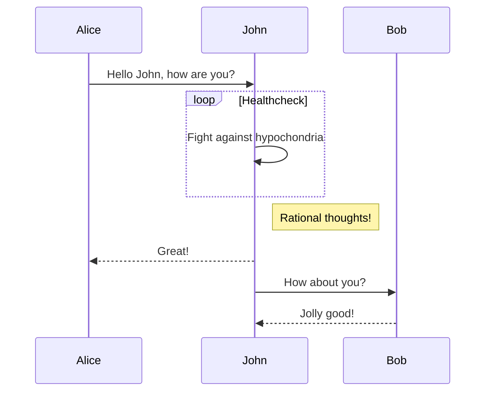
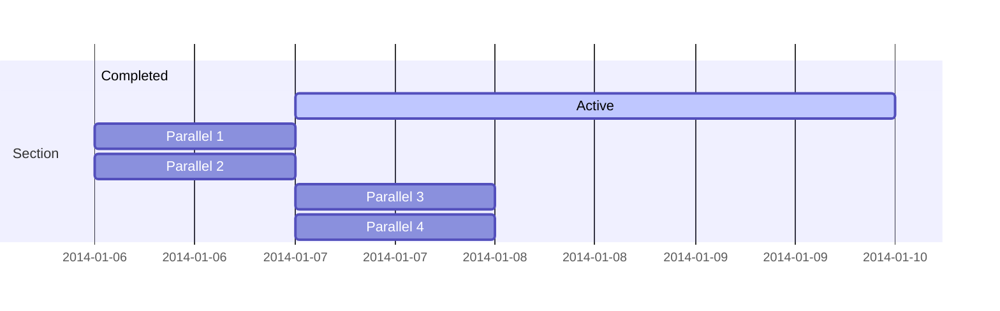

## 背景描述

本文主要记录 Hexo 博客系统搭建过程，以及一些常用插件的集成和使用过程。

<!-- more -->

## 常用插件集成

### PlantUml 安装使用

**作用：** 在 Hexo 中识别并生成由 flow 编写的图表。

**网址：** http://plantuml.com/zh/

**Github地址：** 暂无

**Hexo插件：** [two/hexo-tag-plantuml](https://github.com/two/hexo-tag-plantuml)

**Install：** `npm hexo-tag-plantuml --save`

**示例：**



class Object << general >>
Object <|--- ArrayList

note top of Object : In java, every class\nextends this one.

note "This is a floating note" as N1
note "This note is connected\nto several objects." as N2
Object .. N2
N2 .. ArrayList

class Foo
note left: On last defined class



### flowchart 安装使用

**作用：** 在 Hexo 中识别并生成由 flow 编写的图表。

**网址：** http://flowchart.js.org/

**Github地址：** [adrai/flowchart.js](https://github.com/adrai/flowchart.js)

**Hexo插件：** [bubkoo/hexo-filter-flowchart](https://github.com/bubkoo/hexo-filter-flowchart)

**Install：** `npm install hexo-filter-flowchart --save`

**示例：**

```flow
st=>start: Start|past:>http://www.google.com[blank]
e=>end: End:>http://www.google.com
op1=>operation: My Operation|past
op2=>operation: Stuff|current
sub1=>subroutine: My Subroutine|invalid
cond=>condition: Yes
or No?|approved:>http://www.google.com
c2=>condition: Good idea|rejected
io=>inputoutput: catch something...|request

st->op1(right)->cond
cond(yes, right)->c2
cond(no)->sub1(left)->op1
c2(yes)->io->e
c2(no)->op2->e
```

### mermaid 安装使用

**作用：** 在 Hexo 中识别并生成由 mermaid 编写的图表。

**网址：** https://mermaidjs.github.io/

**Github地址：** [mermaid-js/mermaid](https://github.com/mermaid-js/mermaid)

**Hexo插件：** [webappdevelp/hexo-filter-mermaid-diagrams](https://github.com/webappdevelp/hexo-filter-mermaid-diagrams)

**Install：** `npm install hexo-filter-mermaid-diagrams --save`

**示例：**





### MathJax 安装使用(未生效)

**作用：** MathJax is an open-source JavaScript display engine for LaTeX, MathML, and AsciiMath notation that works in all modern browsers.

**网址：** https://www.mathjax.org/

**Github地址：** [mathjax/MathJax](https://github.com/mathjax/MathJax)

**Hexo插件：** [phoenixcw/hexo-renderer-mathjax](https://github.com/phoenixcw/hexo-renderer-mathjax)

**Install：** `npm install hexo-renderer-mathjax --save`

**示例：**

$$ x = {-b \pm \sqrt{b^2-4ac} \over 2a} $$

$MEMORY*(单节点总核数/NPROC)\leq单节点总内存$

$$ f(x_1,x_x,\ldots,x_n) = x_1^2 + x_2^2 + \cdots + x_n^2 $$

$f(x_1,x_x,\ldots,x_n) = x_1^2 + x_2^2 + \cdots + x_n^2$

$$f(x) = 3x + 7$$

$a = b + c$

$$\frac{\partial u}{\partial t}
= h^2 \left( \frac{\partial^2 u}{\partial x^2} +
\frac{\partial^2 u}{\partial y^2} +
\frac{\partial^2 u}{\partial z^2}\right)$$

$F_a = F_b + F_c + F_{\mu}$

$$lim_{1\to+\infty}P(|\frac{1}{n}\sum_i^nX_i-\mu|<\epsilon)=1, i=1,...,n$$

## 参考资料
- [在Hexo中渲染MathJax数学公式](https://www.jianshu.com/p/7ab21c7f0674)
- [在Hexo中使用Markdown绘制图表](https://segmentfault.com/a/1190000020123689?utm_source=tag-newest)
- [如何在 hexo 中支持 Mathjax？](https://blog.csdn.net/u014630987/article/details/78670258)
- [hexo下LaTeX无法显示的解决方案](https://blog.csdn.net/crazy_scott/article/details/79293576)


