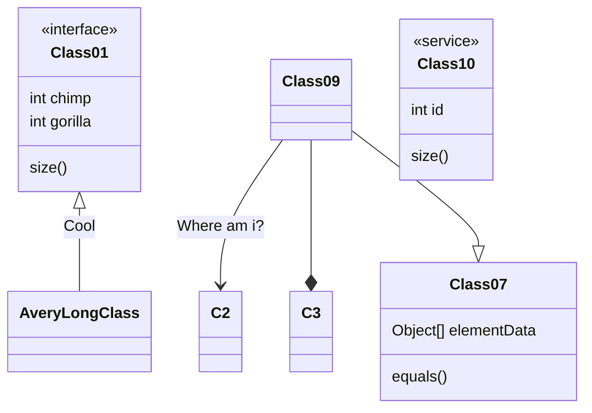
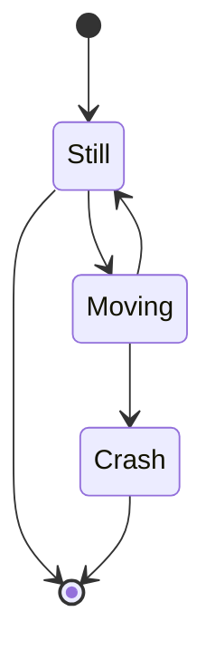
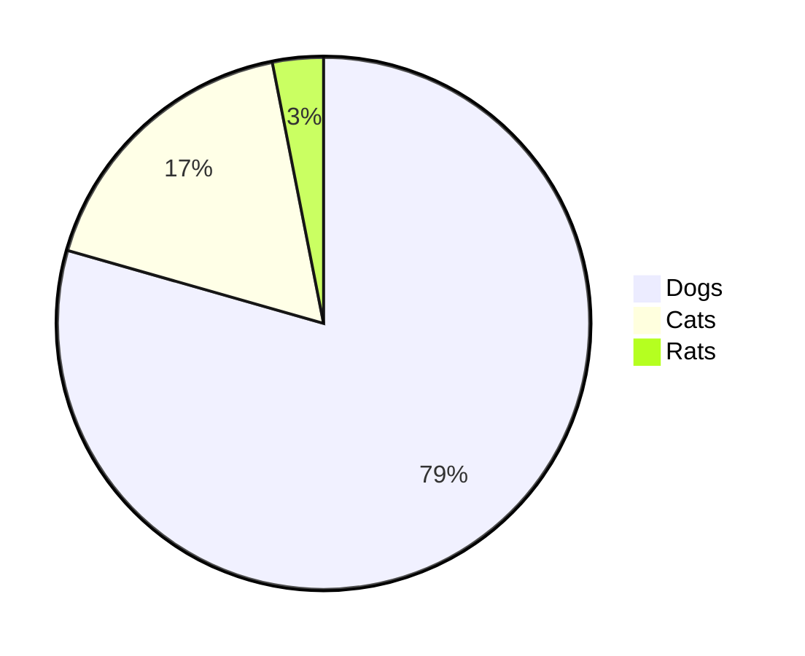

## 背景描述

本文主要记录 Hexo 博客系统搭建过程，以及一些常用插件的集成和使用过程。

<!-- more -->

## PlantUml 安装使用

**作用：** 在 Hexo 中识别并生成由 flow 编写的图表。

**网址：** http://plantuml.com/zh/

**Github地址：** 暂无

**Hexo插件：** [two/hexo-tag-plantuml](https://github.com/two/hexo-tag-plantuml)

**Install：** `npm hexo-tag-plantuml --save`

**示例：**


    Bob->Alice : hello





class Object << general >>
Object <|--- ArrayList

note top of Object : In java, every class\nextends this one.

note "This is a floating note" as N1
note "This note is connected\nto several objects." as N2
Object .. N2
N2 .. ArrayList

class Foo
note left: On last defined class



## flowchart 安装使用

**作用：** 在 Hexo 中识别并生成由 flow 编写的图表。

**网址：** http://flowchart.js.org/

**Github地址：** [adrai/flowchart.js](https://github.com/adrai/flowchart.js)

**Hexo插件：** [bubkoo/hexo-filter-flowchart](https://github.com/bubkoo/hexo-filter-flowchart)

**Install：** `npm install hexo-filter-flowchart --save`

**示例：**

```flow
st=>start: Start|past:>http://www.google.com[blank]
e=>end: End:>http://www.google.com
op1=>operation: My Operation|past
op2=>operation: Stuff|current
sub1=>subroutine: My Subroutine|invalid
cond=>condition: Yes
or No?|approved:>http://www.google.com
c2=>condition: Good idea|rejected
io=>inputoutput: catch something...|request

st->op1(right)->cond
cond(yes, right)->c2
cond(no)->sub1(left)->op1
c2(yes)->io->e
c2(no)->op2->e
```

## mermaid 安装使用

**作用：** 在 Hexo 中识别并生成由 mermaid 编写的图表。

**网址：** https://mermaidjs.github.io/

**Github地址：** [mermaid-js/mermaid](https://github.com/mermaid-js/mermaid)

**Hexo插件：** [webappdevelp/hexo-filter-mermaid-diagrams](https://github.com/webappdevelp/hexo-filter-mermaid-diagrams)

**Install：** `npm install hexo-filter-mermaid-diagrams --save`

**示例：**








## MathJax 安装使用

**作用：** 在 Hexo 中识别并生成由 flow 编写的图表。

**网址：** http://flowchart.js.org/

**Github地址：** [adrai/flowchart.js](https://github.com/adrai/flowchart.js)

**Hexo插件：** [bubkoo/hexo-filter-flowchart](https://github.com/bubkoo/hexo-filter-flowchart)

**Install：** `npm install hexo-filter-flowchart --save`

**示例：**

```flow
st=>start: Start|past:>http://www.google.com[blank]
e=>end: End:>http://www.google.com
op1=>operation: My Operation|past
op2=>operation: Stuff|current
sub1=>subroutine: My Subroutine|invalid
cond=>condition: Yes
or No?|approved:>http://www.google.com
c2=>condition: Good idea|rejected
io=>inputoutput: catch something...|request

st->op1(right)->cond
cond(yes, right)->c2
cond(no)->sub1(left)->op1
c2(yes)->io->e
c2(no)->op2->e
```


